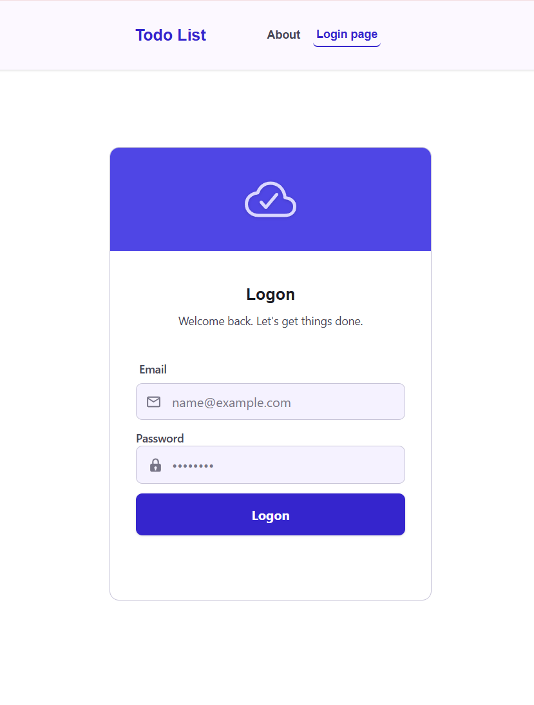
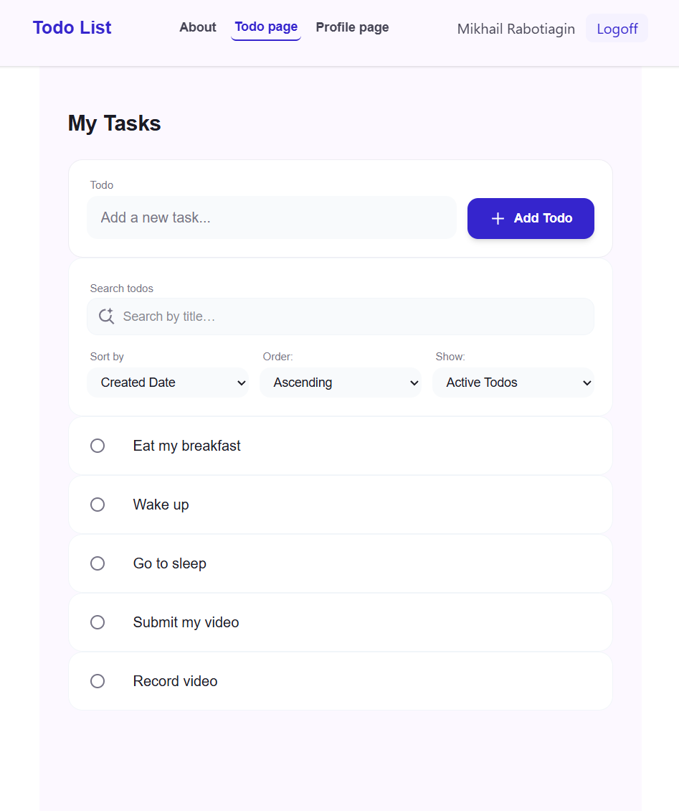
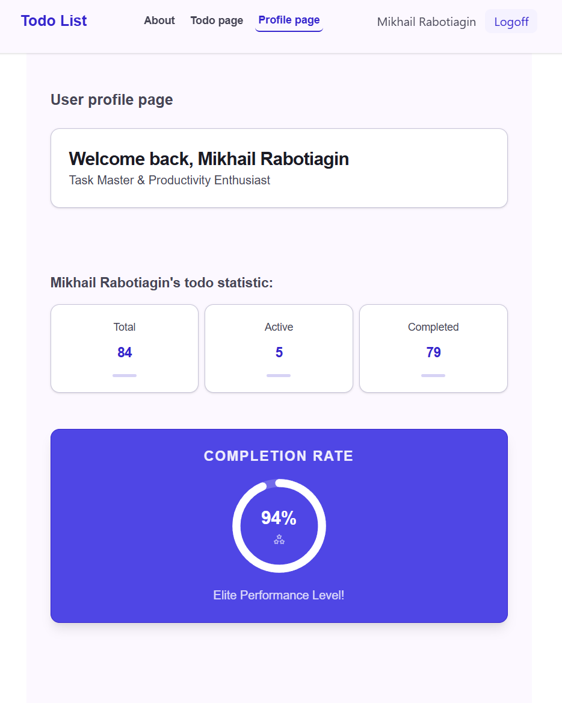
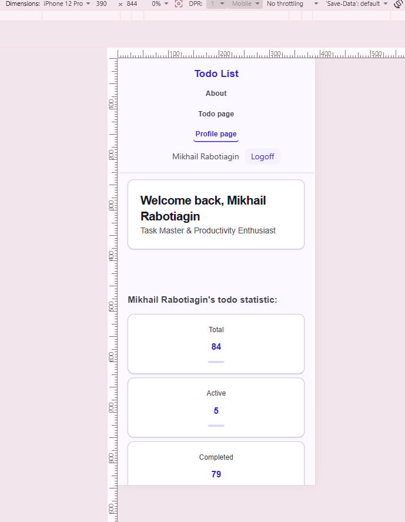
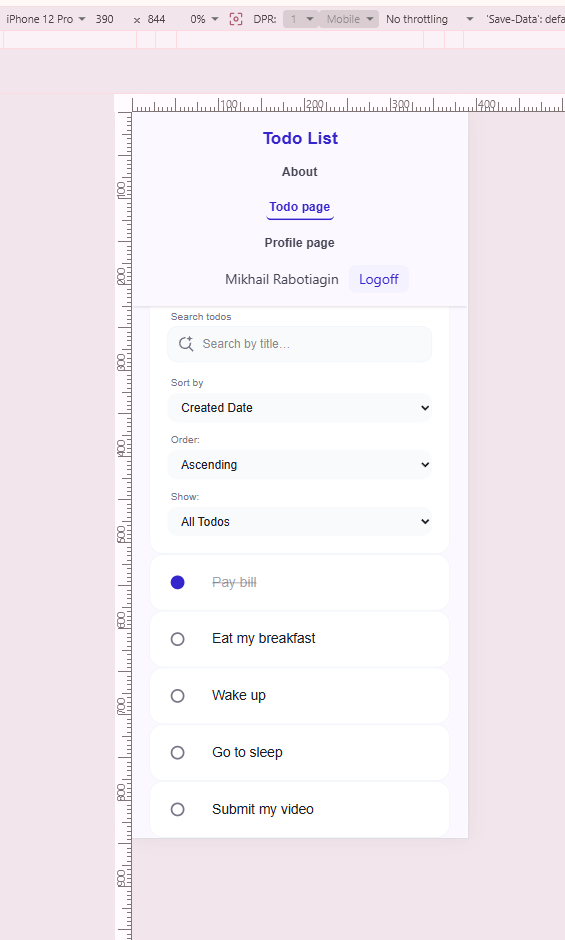
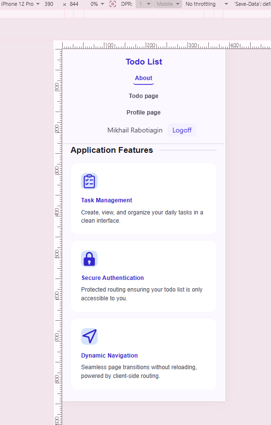

# Todo List App

## Description
A modern, highly responsive, and feature-rich task management Single-Page Application (SPA) designed in accordance with Material Design 3 principles. Developed as a flagship project within the [Code the Dream](https://classes.codethedream.org) React curriculum.


[Live Demo Application](https://todo-list-606qkukc7-mishasro72-8214s-projects.vercel.app)
---

## Features & Functionality Matrix

* **Dynamic Search & Filtering Matrix:** Features an isolated full-width instant search engine coupled with a multi-layered filter and sorting layout grid that flawlessly rearranges on both mobile and desktop screen profiles.
* **Custom Material Design 3 Components:** Formulated custom interactive checkboxes utilizing hidden peer controls, dynamic vector SVG scaling checkmarks, and seamless `line-through` completion transitions.
* **Dynamic Circle Analytics Dashboard:** Includes a dynamic **Completion Rate Progress Circle** driven by inline SVG calculations, live calculated KPI card indicators (Total, Active, Completed), and conditional state reward tracking.
* **Inline Task Refactoring:** Offers instant context switching into inline task mutation states with perfectly bottom-aligned button structures and custom layout resets.

---

## Design Solutions & UI/UX Approach

The user interface strictly adheres to **Material Design 3 (MD3)** design guidelines, prioritizing accessibility, visual hierarchy, and delightful interactions:
* **Color System:** Utilizes a high-contrast container token strategy. Interactive surfaces leverage semantic tokens (`primary-light`, `on-surface-variant`, `surface-container-lowest`), ensuring optimal text readability and clear component boundaries under any display conditions.
* **Responsive Layout Architecture:** Built with a mobile-first philosophy using Tailwind CSS. Navigation elements automatically morph from a space-optimized vertical stack on mobile touch-screens into an expanded horizontal bar on desktop systems.

## Screenshots

### Desktop View
 
 
 


### Mobile View




## Installation Instructions

To set up the project locally, follow these steps:

1. **Clone the repository:**
```bash
git clone https://github.com/mishasro72/todo-list.git
```

2. **Navigate to the project directory:**
```bash
cd todo-list
```

3. **Install dependencies:**
    Ensure you have Node.js installed, then run:
```bash
npm install
```

---

## How to Run the Development Server

1. **To view the app in your browser and start developing:**
```bash
npm run dev
```


2. **Then open your browser and go to:** http://localhost:3001/todos
---

## Available Scripts

In the project directory, you can run the following local scripts for development and deployment testing:

**Launches the local Vite development server with Hot Module Replacement (HMR). You can view the app at `http://localhost:3001`:**
```bash
npm run dev
``` 

**Compiles, tree-shakes, and minifies the raw source files into highly optimized, production-ready static assets. The final compiled bundles are output to the `/dist` directory:**
```bash
npm run build
``` 

**Locally boots a static server to review and test the compiled production build inside the `/dist` folder. Use this command to perform a final smoke test before pushing changes live:**
```bash
npm run preview
```

## Future Improvements

In the near future, I plan to actively implement the following features as the next milestones for improving the application:

* **Task Prioritization Matrix:** Add the ability to set priority levels (High, Medium, Low) for each task, automatically highlighting them with distinct semantic colors depending on their urgency.
* **Due Date & Time Tracking:** Introduce execution deadlines for tasks, featuring smart chronological sorting to display upcoming items in order of their strict sequence.
* **Native Dark Theme:** Implement a dark mode toggle adhering to Material Design 3 guidelines to reduce eye strain and improve readability in low-light environments.

## Tech Stack & Ecosystem

* **UI Library:** React (Functional Components, Hooks, Context API)
* **Build Architecture:** Vite
* **Styling Framework:** Tailwind CSS (Utility-first, Peer-modifiers)
* **Routing Engine:** React Router (Single-Page Routing Architecture)
* **Language Specification:** JavaScript (JSX)

## License Information

This project uses third-party icons distributed under the MIT License.

Ionicons
Copyright (c) 2015-present Ionic (http://ionic.io/)
For more information, see:
https://github.com/ionic-team/ionicons/blob/main/LICENSE

Microsoft Icons
Copyright (c) 2020 Microsoft Corporation
For more information, see:
https://github.com/microsoft/fluentui-system-icons/blob/main/LICENSE


Copyright (c) 2020-2026 Paweł Kuna
https://github.com/tabler/tabler-icons/blob/main/LICENSE

## Contact Information
**Developer Profile:** [Mikhail Rabotiagin (GitHub)](https://github.com/mishasro72)

**Professional Showcase:** [Me on Linkedin](https://www.linkedin.com/in/mike-r-sqa/)